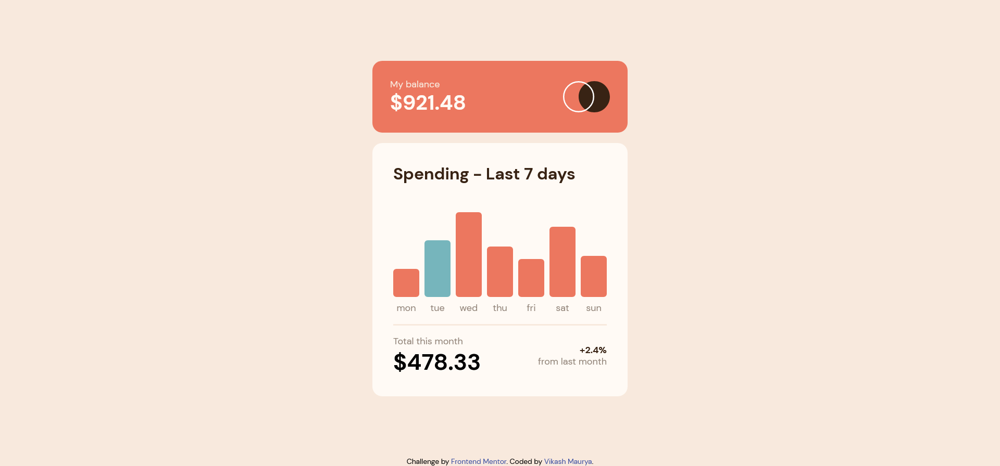
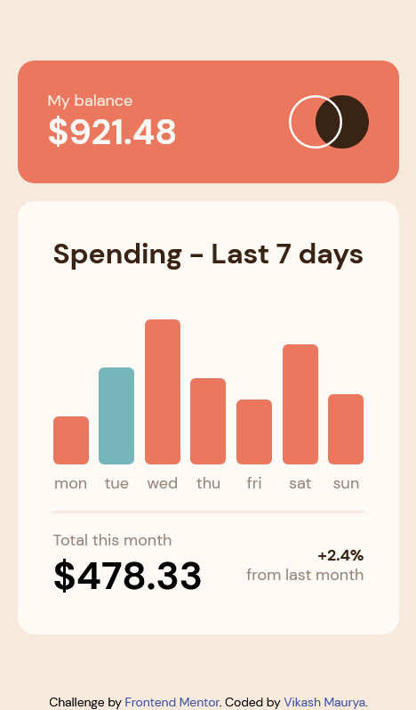

# Frontend Mentor - Expenses chart component solution

This is a solution to the [Expenses chart component challenge on Frontend Mentor](https://www.frontendmentor.io/challenges/expenses-chart-component-e7yJBUdjwt).

## Table of contents

- [Overview](#overview)
  - [The challenge](#the-challenge)
  - [Screenshot](#screenshot)
  - [Links](#links)
- [My process](#my-process)
  - [Built with](#built-with)
  - [What I learned](#what-i-learned)
  - [Useful resources](#useful-resources)
- [Author](#author)

## Overview

### The challenge

Users should be able to:

- View the bar chart and hover over the individual bars to see the correct amounts for each day
- See the current day’s bar highlighted in a different colour to the other bars
- View the optimal layout for the content depending on their device’s screen size
- See hover states for all interactive elements on the page
- **Bonus**: Use the JSON data file provided to dynamically size the bars on the chart

### Screenshot

| Desktop                               | Mobile                               |
| ------------------------------------- | ------------------------------------ |
|  |  |

### Links

- Solution URL: [get solution🌐](https://github.com/VikashMaurya10/expenses-chart-component-main)
- Live Site URL: [view🌐](https://vikashmaurya10.github.io/expenses-chart-component-main/)

## My process

### Built with

- Semantic HTML5 markup
- SCSS custom properties
- Flexbox
- Mobile-first workflow
- [JQuery](https://jquery.com/) (JavaScript library)

### What I learned

During completion this task I learned:

- How to manupulate the html by using `JQuery`, which is JavaScript library. It's easy to learn and understand.
- How to fatch data from `JSON file`.

To see how you can add code snippets, see below:

```JQuery
$.getJSON("./assets/data/data.json", (data) => {
  $.each(data, (index, value) => {
    $(".graph").append(`
        <div id=graph-${index}>
            <div>$${value.amount}</div>
            <div id="${index}" style="height:0px;"></div>
            <p>${value.day}</p>
        </div>
      `);
  });
});
```

### Useful resources

- [Figma](https://www.figma.com) - This helped me for measuring the actual design. I really liked this pattern and will use it going forward.

## Author

- website - [@vikashmaurya](https://github.com/VikashMaurya10/VikashMaurya10)
- Frontend Mentor - [@vikashmaurya](https://www.frontendmentor.io/profile/VikashMaurya10)
- LinkedIn - [@in-vikashmaurya](https://www.linkedin.com/in/in-vikashmaurya)
